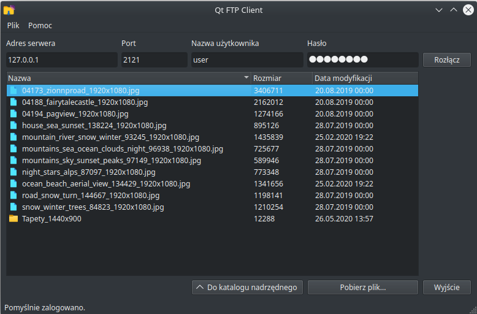
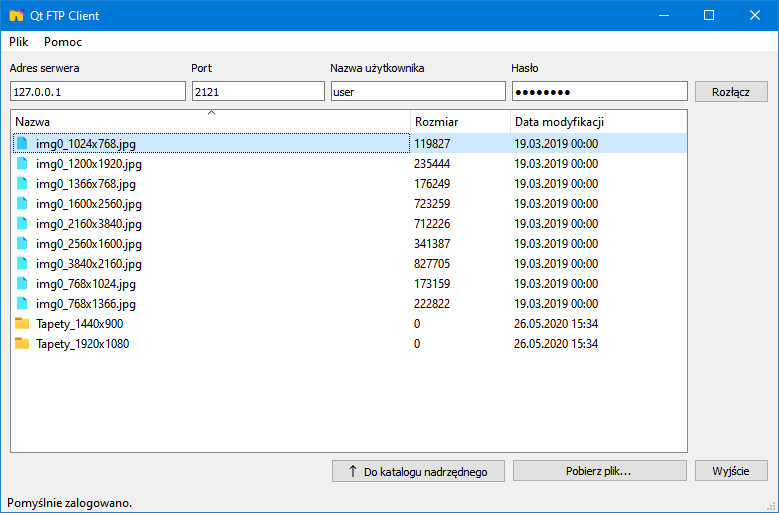

# QtFtpClient
Prosty klient FTP oparty o framework Qt

 

# Zależności

* QFtp (https://github.com/qt/qtftp)

## Instalacja

Należy przejść do folderu, w którym zainstalowany jest Qt Creator, następnie do folderu z numerem wersji (np. 5.14.2) i do folderu `Src`. Następnie należy pobrać i rozpakować bibliotekę:
```
git clone https://github.com/qt/qtftp.git
cd qtftp-master
```
Aby biblioteka mogła być widziana przez Qt Creator, należy w podkatalogu `src/qtftp` edytować plik `qtftp.pro` poprzez dodanie poniższej linii:

`CONFIG -= create_pri`

Następnie należy wygenerować odpowiednie pliki nagłówkowe (wymagany Perl):

`../../gcc-64/bin/syncqt.pl -version 5.14.2`

Kompilacja:
```
../../gcc-64/bin/qmake
make
make install
```
W zależności od platformy zamiast `make` można użyć np. `mingw32-make`.
